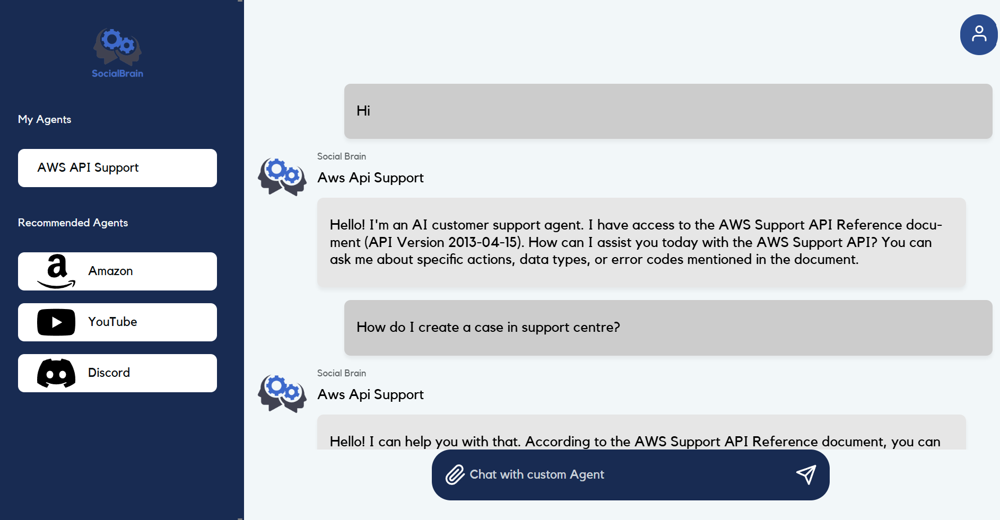

# 🤖 SocialBrain 💬

## 🌟 Introduction
Welcome to the SocialBrain Chatbot repository! This project allows users to create custom AI-powered chatbots that interact with users based on pre-defined instructions and knowledge bases. The platform offers a seamless and intuitive interface for managing chatbots, enabling both personal and public usage.



## 💡 Features
- **Custom AI Agents:** Create and configure AI chatbots with user-defined instructions and knowledge base files.
- **Context Caching:** Leverages Vertex AI context caching for efficient repeated queries on knowledge bases.
- **Conversation Persistence:** Chat history is stored and maintained across sessions.
- **User Authentication:** Secure login functionality for creating and managing personal agents.
- **File Upload for Resources:** Upload PDF files to train agents with specific knowledge.
- **Interactive Chat Interface:** Engage with chatbots in a dynamic user interface.
- **Agent Selection:** Choose between personal and public agents for different use cases.

## 💻 Technologies
- **Django:** Backend framework powering the platform's core functionality and authentication system.
- **Google Vertex AI:** Leverages Google's AI capabilities with context caching for intelligent content generation.
- **Gemini 1.5 Pro:** Large language model used for generating agent responses.
- **HTML/CSS/JavaScript:** Frontend stack for building interactive pages and chat interfaces.
- **SQLite/PostgreSQL:** Database for managing users, agents, chat history, and resources.

## 🛠️ Installation and Setup

### Prerequisites
- Python 3.10+
- Google Cloud account with Vertex AI API enabled
- Service account with Vertex AI User permissions

### Clone the repository
```bash
git clone https://github.com/CodeConfluence/Django-OpenAI-Chatbot.git
cd Django-OpenAI-Chatbot/my_chatbot
```

### Set up a Virtual Environment
```bash
python3 -m venv venv
source venv/bin/activate
```

### Install dependencies
```bash
pip install django python-decouple google-cloud-aiplatform Pillow django-sendgrid-v5
```

### Create a `.env` file in the root directory
```
SENDGRID_API_KEY=your_sendgrid_api_key
DEFAULT_FROM_EMAIL=your_default_email@example.com
GOOGLE_PROJECT_ID=your_google_cloud_project_id
GOOGLE_CLOUD_REGION=us-central1
GCS_BUCKET_NAME=your_gcs_bucket_name
```

### Set up Google Cloud authentication
```bash
export GOOGLE_APPLICATION_CREDENTIALS="/path/to/your-service-account-key.json"
```

### Run database migrations and start the server
```bash
python manage.py migrate
python manage.py runserver
```

Open http://localhost:8000 in your web browser to view the platform.

## 📁 Directory Structure
- `views.py` - Contains views for managing agents, user authentication, and CRUD operations.
- `views_genai.py` - Handles Vertex AI integration with context caching for chat generation.
- `models.py` - Defines database models for agents, resources, chat history, and messages.
- `forms.py` - Handles forms for creating/updating agents and uploading resources.
- `templates/` - Contains all HTML templates for rendering the frontend pages.
- `static/` - Holds static files including CSS, JavaScript, and images.

## 📝 Usage
1. Create an account to start managing your custom AI agents.
2. Upload knowledge base files in PDF format to enhance your chatbot's responses.
3. Configure chatbot instructions for guiding how the chatbot interacts with users.
4. Generate intelligent responses by interacting with your chatbots in real-time.
5. Chat history is automatically saved and persisted across sessions.

## 📬 Contact
For inquiries or feedback, please reach out via email at [zhangbri@umich.edu](mailto:zhangbri@umich.edu) and [snkris@umich.edu](mailto:snkris@umich.edu) or connect with us on LinkedIn: [Brian Zhang](https://www.linkedin.com/in/zhangbri/), [Kristan Nagassar](https://www.linkedin.com/in/kristan-seenath-nagassar-922720290), and [Jesus Garcia](https://www.linkedin.com/in/jesus-garcia-b57261310/).
